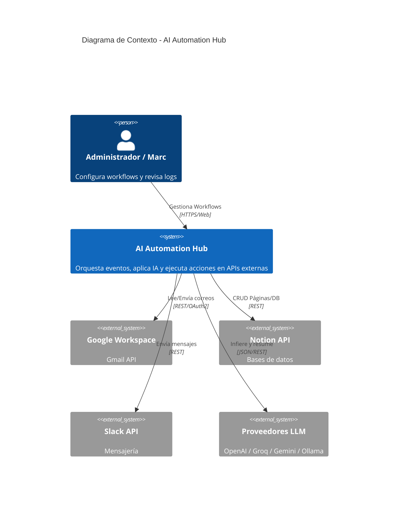
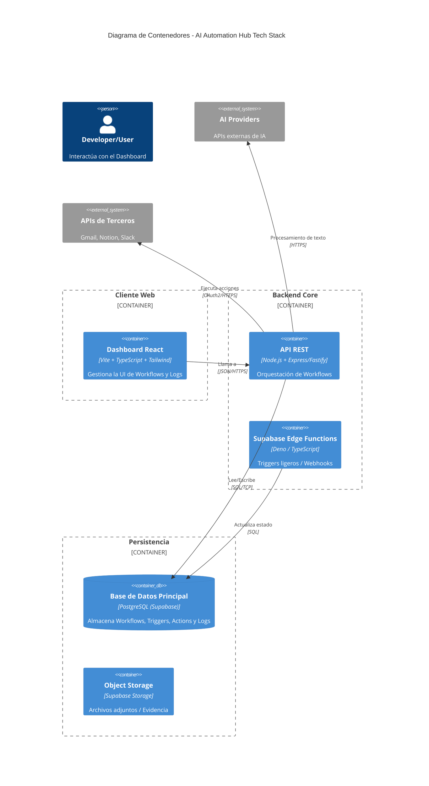
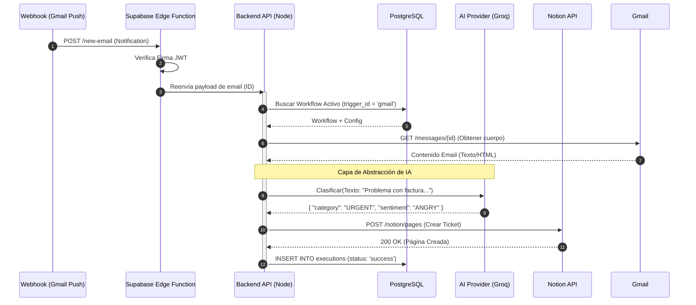
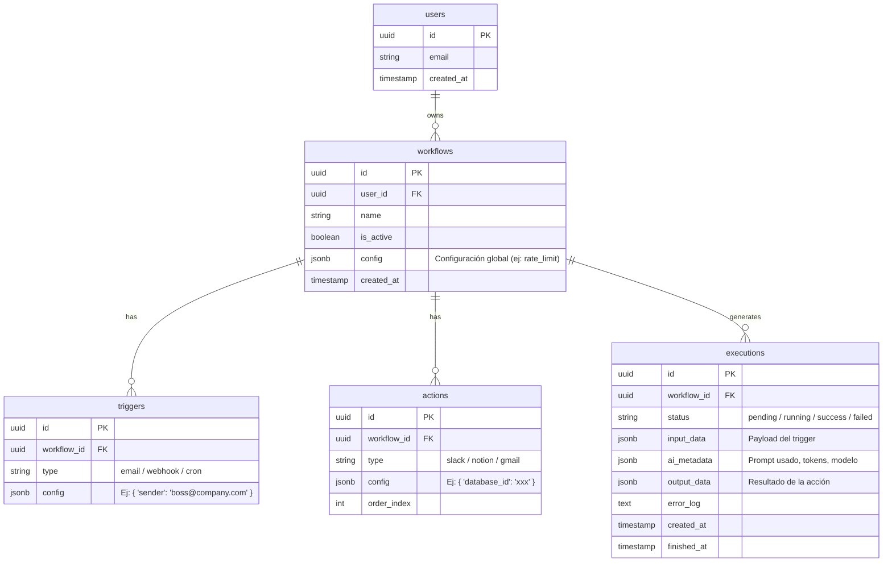

# DOCUMENTACIÓN DEL PROYECTO 1 — AI AUTOMATION HUB

**Versión:** 1.0.0  
**Autor:** Marc — AI Product Engineer  
**Estado:** 🟢 Planificación y Diseño de Arquitectura

---

## 1. Constitución y Visión General

**AI Automation Hub** es una plataforma de orquestación de workflows inteligentes diseñada para cerrar la brecha entre los eventos del negocio (emails, webhooks, cron) y la ejecución autónoma mediante IA Generativa.

**Diferenciador clave:**  
No es solo un *pipe* de datos (como Zapier), sino un **motor de decisión**. Utiliza LLMs para interpretar la *intención* y el *contenido* no estructurado antes de ejecutar acciones estructuradas.

---

## 2. Objetivos Estratégicos y Finalidad

| Eje | Objetivo | Métrica de Éxito (KPI) |
| :--- | :--- | :--- |
| **Producto** | Reducción de tareas manuales cognitivas | Ejecución automática del 90% de workflows sin intervención humana |
| **Ingeniería** | Demostrar desacoplamiento de proveedores de IA | Capacidad de cambiar de OpenAI a Ollama local en < 5 líneas de código |
| **Arquitectura** | Escalabilidad horizontal | Procesamiento de 100+ ejecuciones concurrentes vía Edge Functions |
| **Portfolio** | Demostrar seniority en diseño de sistemas | Documentación completa, diagramas Mermaid y testing automatizado |

---

## 3. Especificación del Sistema y Alcance Funcional

### 3.1. Módulos Core (MVP)
1.  **Workflow Engine:** Motor de estados para ejecutar `Trigger -> AI Logic -> Action`.
2.  **AI Abstraction Layer (Crítico):** Middleware que normaliza las respuestas de OpenAI, Groq, Gemini y Ollama.
3.  **Connectors Hub:** Clientes HTTP tipados para Gmail, Notion y Slack.
4.  **Observabilidad:** Tabla de `executions` con trazabilidad completa de `input > AI prompt > output > action result`.

### 3.2. Clarificación del Alcance (In/Out)
- **DENTRO:** Workflows lineales, Function Calling básico para extracción de datos, Logs inmutables.
- **FUERA (V2):** Ramificaciones condicionales complejas (if/else anidados), Agentes autónomos con loops de retroalimentación, Multi-tenancy empresarial.

---

## 4. Arquitectura del Sistema (Diagramas Mermaid)

A continuación se presentan los diagramas de arquitectura en formato **Mermaid**. Estos se renderizarán automáticamente en GitHub o VS Code.

### 4.1. Diagrama de Contexto (C4 - Nivel 1)
Muestra la interacción del sistema con usuarios y servicios externos.

### 4.2. Diagrama de Contenedores (C4 - Nivel 2)
Desglose técnico de la aplicación.

### 4.3. Diagrama de Secuencia: Workflow de Clasificación de Emails
Visualiza el flujo exacto de una automatización (Ej: *Cuando llegue un email a soporte → IA clasifica urgencia → Crea tarea en Notion*).

---

## 🧪 5. Modelo de Datos (Supabase PostgreSQL)

Diseño relacional optimizado para consultas rápidas de ejecución y logs.

---

## 📅 6. Plan de Trabajo Detallado (Roadmap de 1 Mes)

| Semana | Foco Principal | Entregables Técnicos | Demo Checkpoint |
| :--- | :--- | :--- | :--- |
| **1** | **Arquitectura y Setup** | - Repo inicializado (Monorepo `apps/backend`, `apps/frontend`). - Capa de abstracción de IA testeada con 2 providers. - Esquema de DB en Supabase aplicado. | El backend responde a un `curl` con una clasificación IA mock. |
| **2** | **Motor de Workflows** | - Sistema de `Triggers` (Gmail Webhook). - Sistema de `Actions` (Notion). - Middleware de Logging. | Recibir un email real y ver el log de ejecución en DB. |
| **3** | **IA Aplicada y Frontend** | - Dashboard con lista de workflows. - Editor visual básico (Formulario). - Integración de Function Calling para extraer datos. | Crear un workflow desde la UI que extraiga "Nombre" y "Motivo" de un email. |
| **4** | **Pulido y Documentación** | - Mejoras de UI (Tailwind, Shadcn/ui). - Vídeo Demo de 3 min. - **ESTA DOCUMENTACIÓN.** | Demo pública en Vercel/Railway. |

---

## 🧰 7. Stack Tecnológico Definitivo

| Capa | Tecnología | Justificación Técnica |
| :--- | :--- | :--- |
| **Frontend** | React + Vite + Tailwind + Shadcn/ui | Velocidad de desarrollo y aspecto profesional inmediato. |
| **Backend** | Node.js + TypeScript + Fastify | Mayor rendimiento que Express, validación de esquemas nativa. |
| **Base de Datos** | Supabase (PostgreSQL) | Row Level Security incluido, Realtime para logs en vivo, Storage para archivos. |
| **IA** | **Adapter Pattern** (OpenAI / Groq / Ollama) | **Ventaja clave:** Podemos usar Groq (rápido/gratis) para desarrollo y OpenAI (preciso) para demo final sin cambiar código de negocio. |
| **Integraciones** | Nango (Opcional) o Clientes OAuth2 nativos | Evita reinventar la rueda en la gestión de tokens OAuth de Gmail/Notion. |

1.  **Inicializar el Monorepo:** `pnpm create turbo@latest`.
2.  **Configurar Supabase:** Crear proyecto y ejecutar el script SQL basado en el diagrama `erDiagram`.
3.  **Implementar el `AIService`:** Crear el archivo `packages/core/src/ai/factory.ts` que elija entre `groq` y `openai` según variable de entorno.

¿Quieres que genere ahora el código del **Factory Pattern para la IA** o prefieres que preparemos el **Script SQL para crear las tablas en Supabase**?
